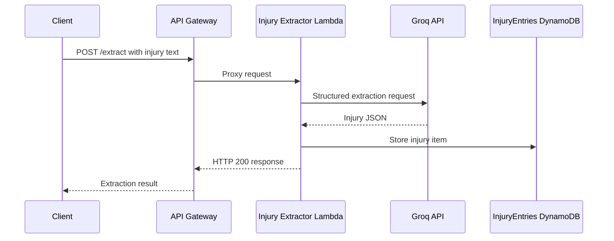

# AI Injury Extractor

A serverless AI-powered application that transforms free-text injury descriptions into structured medical data using AWS Lambda, API Gateway, DynamoDB, Terraform, and Groq LLMs.

## Features

- Extracts structured injury information from natural language
- Serverless architecture built on AWS
- REST API powered by API Gateway and Lambda
- Stores extracted records in DynamoDB
- Infrastructure managed with Terraform
- Ready to integrate with a Next.js frontend

## Tech Stack

- Python
- AWS Lambda
- Amazon API Gateway
- Amazon DynamoDB
- Terraform
- Groq API (Llama 3.3)
- GitHub Actions (coming soon)

## Architecture



```
Next.js
    │
    ▼
API Gateway
    │
    ▼
AWS Lambda
    │
    ▼
Groq LLM
    │
    ▼
DynamoDB
```

## Install Lambda dependencies

From the Lambda directory:

```bash
cd lambda
pip install -r requirements.txt -t package
```

## Deploy Lambda

```powershell
Compress-Archive -Path handler.py,package\* -DestinationPath function.zip
```

## Test the API (Development only)

> This endpoint is currently unauthenticated and intended for development/testing.
> Authentication, authorization, and rate limiting will be added before production deployment.

```bash
curl -X POST \
https://YOUR_API_URL/dev/extract \
-H "Content-Type: application/json" \
-d '{"text":"I have had left hip pain for four years after gym training."}'
```

# Useful Commands

## Test Groq API directly

```bash
curl https://api.groq.com/openai/v1/chat/completions \
-H "Authorization: Bearer YOUR_GROQ_API_KEY" \
-H "Content-Type: application/json" \
-d '{
  "model": "llama-3.1-8b-instant",
  "messages": [
    {
      "role": "user",
      "content": "Say hello"
    }
  ]
}'
```

---

## Test Lambda through API Gateway

```bash
curl -X POST \
https://YOUR_API_ID.execute-api.eu-north-1.amazonaws.com/dev/extract \
-H "Content-Type: application/json" \
-d '{"text":"I have had left hip pain for 4 years after gym training."}'
```

---

## Update Lambda code

```bash
aws lambda update-function-code \
--function-name injury-extractor \
--zip-file fileb://function.zip
```

---

## Update Lambda environment variable

```bash
aws lambda update-function-configuration \
--function-name injury-extractor \
--environment "Variables={GROQ_API_KEY=YOUR_KEY,DYNAMODB_TABLE=InjuryEntries}"
```

---

## Get current Lambda environment variables

```bash
aws lambda get-function-configuration \
--function-name injury-extractor
```

---

## Tail Lambda logs

```bash
aws logs tail /aws/lambda/injury-extractor --follow
```

---

## Invoke Lambda directly

```bash
aws lambda invoke \
--function-name injury-extractor \
--payload '{"body":"{\"text\":\"I have hip pain\"}"}' \
response.json

cat response.json
```

---

## Scan DynamoDB table (development only)

```bash
aws dynamodb scan \
--table-name InjuryEntries
```

---

## Zip Lambda package

PowerShell

```powershell
Remove-Item function.zip -ErrorAction Ignore

Compress-Archive -Path handler.py,package\* -DestinationPath function.zip
```

---

## Useful AWS CLI checks

Current AWS identity

```bash
aws sts get-caller-identity
```

Current region

```bash
aws configure get region
```

List Lambda functions

```bash
aws lambda list-functions
```

## Troubleshooting

### ModuleNotFoundError

Reinstall dependencies into the `package/` directory and recreate `function.zip`.

### Lambda updated but code didn't change

Upload a new `function.zip` and verify the `LastModified` timestamp in the Lambda console.

### Groq returns 401

- Verify `GROQ_API_KEY`
- Test the API directly with `curl`
- Confirm the key is active

### API Gateway returns 500

Check CloudWatch logs:

```bash
aws logs tail /aws/lambda/injury-extractor --follow
```

### API Gateway returns 403

Verify the endpoint URL and deployment stage.

### API Gateway returns 404

Confirm the `/extract` resource and `POST` method are deployed.
